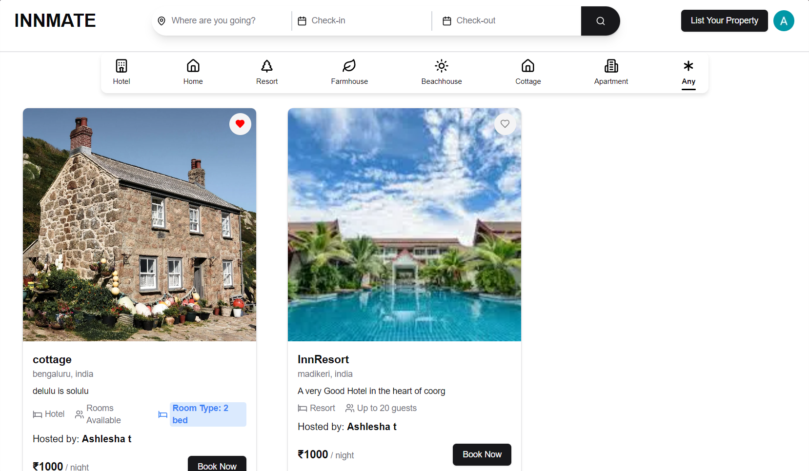
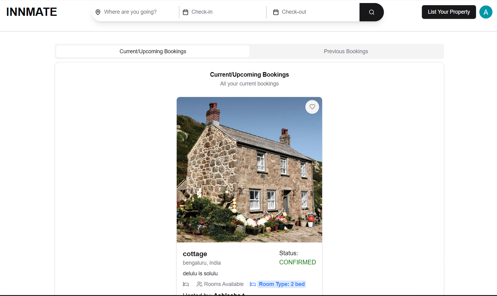
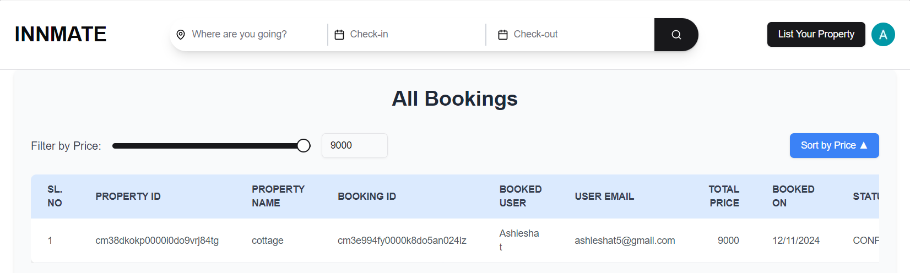
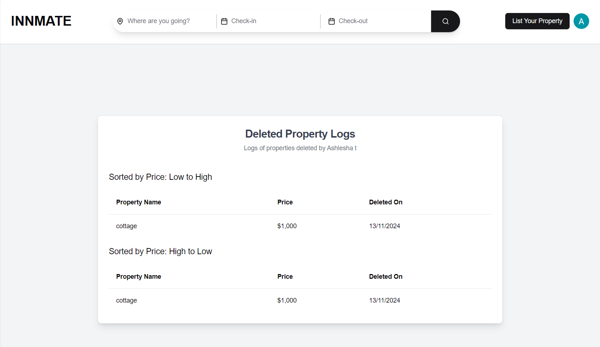

# InnMATE - Role-Based Hotel Management System

This is a [Next.js](https://nextjs.org) project bootstrapped with [`create-next-app`](https://nextjs.org/docs/app/api-reference/cli/create-next-app).

# Getting Started

## Setup and Configuration Guide

Follow the instructions below to set up and configure the required credentials for the **InnMATE** project. These credentials are necessary to integrate external services like **Kinde**, **Stripe**, **Uploadcare**, **Google ReCaptcha**, and **SMTP**.

### 1. **Clone the Repository**
First, clone the project repository to your local machine:
```bash
git clone https://github.com/your-username/innmate.git
```

### 2. **Install Dependencies**
Navigate to the project directory and install the necessary dependencies:
```bash
cd innmate
```
Install dependencies
```bash
npm i 
```
or
```bash
npm i --legacy-peer-deps
```


### 3. **Edit `.env` File**
* Add your MySQL Databse password [ install mySQL is not done ALready : https://www.mysql.com/downloads/]

### 4. **Edit `.env.local` File**


###  **Configure Environment Variables**

Below are detailed instructions on how to get all the necessary API keys and credentials for the project:

---

#### **Kinde Credentials**  

To obtain the **Kinde API Keys**, follow these steps:

1. Go to [Kinde Developer Console](https://www.kinde.com).
2. Log in or sign up for a new account.
3. Create a new **OAuth Application**.
4. Once the application is created, you will get the following keys:
   - `KINDE_CLIENT_ID`: Find this in the **OAuth Application** settings.
   - `KINDE_CLIENT_SECRET`: This is also available in the same section of your **OAuth Application** settings.
   - `KINDE_ISSUER_URL`: This will be in the format `https://<Your_Kinde_Name>.kinde.com`.
   
Add these values to your `.env` file:
```
KINDE_CLIENT_ID=your_kinde_client_id
KINDE_CLIENT_SECRET=your_kinde_client_secret
KINDE_ISSUER_URL=https://<Your_Kinde_Name>.kinde.com
```

---

#### **Stripe API Keys**

To obtain **Stripe API keys**, follow these steps:

1. Go to the [Stripe Dashboard](https://dashboard.stripe.com).
2. Log in or create a new account if you don't already have one.
3. Navigate to **Developers** -> **API keys** in the Stripe dashboard.
4. You will find the following keys:
   - `STRIPE_SECRET_KEY`: The secret key used for server-side API requests.
   - `STRIPE_WEBHOOK_SECRET`: This is the key used for Stripe Webhooks.
   - `NEXT_PUBLIC_STRIPE_PUBLISHABLE_KEY`: The public key used for client-side Stripe integration.

Add the values to your `.env` file:
```
STRIPE_SECRET_KEY=your_stripe_secret_key
STRIPE_WEBHOOK_SECRET=your_stripe_webhook_secret
NEXT_PUBLIC_STRIPE_PUBLISHABLE_KEY=your_stripe_publishable_key
```

---

#### **Uploadcare API Keys**

To obtain **Uploadcare API keys**, follow these steps:

1. Go to the [Uploadcare Dashboard](https://uploadcare.com).
2. Create a new account or log in if you already have one.
3. In the **API** section, you will get:
   - `UPLOADCARE_SECRET_KEY`: The private API key.
   
Add the value to your `.env` file:
```
NEXT_PUBLIC_UPLOADCARE_BASE_URL=https://ucarecdn.com
UPLOADCARE_SECRET_KEY=your_uploadcare_secret_key
```

---

#### **Google ReCaptcha Keys**

To obtain **Google ReCaptcha API keys**, follow these steps:

1. Visit [Google ReCaptcha](https://www.google.com/recaptcha) and sign in with your Google account.
2. Register a new site and choose the type of ReCaptcha (usually **reCAPTCHA v2** or **v3**).
3. After registering, you will get:
   - `RECAPTCHA_SECRET_KEY`: This is used for server-side verification.
   - `NEXT_PUBLIC_RECAPTCH_SITE_KEY`: This is used on the client-side for embedding the ReCaptcha.

Add the values to your `.env` file:
```
RECAPTCHA_SECRET_KEY=your_recaptcha_secret_key
NEXT_PUBLIC_RECAPTCH_SITE_KEY=your_recaptcha_site_key
```

---

#### **SMTP Configuration (For Gmail)**

To send emails via Gmail's SMTP service, you need to configure the following:

1. Log in to your [Gmail Account](https://mail.google.com).
2. Enable **2-Step Verification** if it’s not already enabled.
3. Create a **Google App Password**:
   - Go to [Google Account Settings](https://myaccount.google.com).
   - Navigate to **Security** -> **App passwords** and generate a new app password for "Mail".
   
This will generate a 16-character password that you can use instead of your regular Gmail password.

Add the values to your `.env` file:
```
SMTP_USER=your_gmail_account@gmail.com
SMTP_PASS=your_google_app_password
```

---

### **Important Notes**
- Ensure that all environment variables are correctly set to avoid issues when running the application.
- Do **not** push the `.env` file to GitHub to prevent exposing your sensitive credentials. Make sure to add `.env` to `.gitignore`.

## Run The development Server
First, run the development server:

```bash
npm run dev
# or
yarn dev
# or
pnpm dev
# or
bun dev
```

Open [http://localhost:3000](http://localhost:3000) with your browser to see the result.

## Images:






You can start editing the page by modifying `app/page.tsx`. The page auto-updates as you edit the file.

This project uses [`next/font`](https://nextjs.org/docs/app/building-your-application/optimizing/fonts) to automatically optimize and load [Geist](https://vercel.com/font), a new font family for Vercel.


## Learn More

To learn more about Next.js, take a look at the following resources:

- [Next.js Documentation](https://nextjs.org/docs) - learn about Next.js features and API.
- [Learn Next.js](https://nextjs.org/learn) - an interactive Next.js tutorial.

You can check out [the Next.js GitHub repository](https://github.com/vercel/next.js) - your feedback and contributions are welcome!

## Deploy on Vercel

The easiest way to deploy your Next.js app is to use the [Vercel Platform](https://vercel.com/new?utm_medium=default-template&filter=next.js&utm_source=create-next-app&utm_campaign=create-next-app-readme) from the creators of Next.js.

Check out our [Next.js deployment documentation](https://nextjs.org/docs/app/building-your-application/deploying) for more details.


